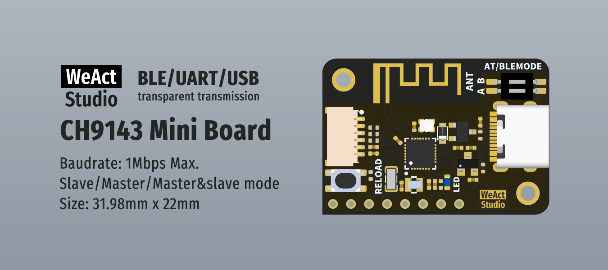

* [中文版本](./README_zh.md)
# WeActStudio.CH9143_BLE2USB2UART

The CH9143 is a BLE/UART/USB three-way chip that enables data transfer between Bluetooth, USB, and serial ports. Bluetooth supports host mode, slave mode and master-slave integrated mode, and Bluetooth communication and parameters can be configured under slave mode and master-slave integrated mode, supporting BLE4.2. The serial port supports AT command configuration, supports MODEM contact signal, and has a maximum baud rate of 1Mbps. At the same time, it can realize online debugging or data monitoring between computer USB interface, serial port and Bluetooth.  
WCH official website www.wch.cn(zh-CN) / www.wch-ic.com(en)  
## Function description
`One board` can be used as a USB to serial port module and Bluetooth serial port module, for Bluetooth serial port module, WCH provides virtual serial port software `BleComWin`, as long as the computer supports connection BLE, you can virtual a COM port without connecting USB. In addition, there are wechat small program, Android, IOS, Linux, Windows directly connected to BLE serial port software, named `BleUart`, provides BLE serial port device automatic search connection, open and close, serial port parameter setting, MODEM operation, serial port reading and writing functions. The maximum baud rate is 1Mbps.  
`Two boards`, to achieve wireless serial port function, the highest baud rate of 1Mbps.  
>> `BleComWin` and `BleUart`, see `Softs` folder
### Slave mode
In slave mode, the chip sends fixed broadcast data. The default broadcast name is `CH9143BLE2U`, and the broadcast interval is 100ms. The slave supports four basic Bluetooth services, of which the passthrough service UUID is 0xFFF0.
### Master-slave mode
In master-slave mode, the Bluetooth host and slave work at the same time, and when one role is connected to the other Bluetooth, the other role will be stopped. It should be noted that as a Bluetooth host, the CH9143 chip can only connect with other WCH Bluetooth chips.
### Smart pairing function
When the CH9143 is in master/slave mode, the CH914x can be paired with a specific CH914X chip without entering the MAC address by running the AT command. After the CH9143 chip is paired, the CH914X chip is bound to each other and does not need to be paired again. The matching process is as follows:  
1. The CH9143 is in master-slave mode. The CH9143 is in slave mode or master-slave mode.
2. Power on both parties within 3s.
3. If the indicator blinks for three times and then keeps on, the pairing is successful.  

If you need to re-establish a pair, you need to go through the pairing process again. The difference is that the indicator in Step 3 blinks quickly. In this case, you can re-establish a pair by powering on any end.

## Interface description
### 6 Pin SH1.0 interface
|PIN|Instructions|
|:--:|:--|
|GND|The signal/power ground|
|RXD|Serial port receive (input, level 3.3V)|
|TXD|3.3V Serial port transmission (output, level 3.3V)|
|TNOW|The serial port sends data status pin, active high|
|3V3|3.3V power output|
|5V|5V power output|

### AT/BLEMODE DIP switch
|No.|Description|
|:--:|:--|
|A|ON, AT the mode is enabled|
|B|ON, the slave mode is enabled|

### RELOAD button
Press the RELOAD button before power-on and release it 3 seconds later to restore factory Settings. The indicator light will not light up during this process.  
* When two boards need to be paired, it is recommended to fix one of the boards to slave mode through `AT/BLEMODE DIP`, when you need to unpair, just restore the host.
* When the two boards are in master-slave mode and need to be unpaired, it is impossible to tell which board is the host and which board is the slave, so both boards should be restored to factory Settings. In fact, if you know who the host is, just restore the host.

### Blue light
|No.|Status|Description|
|:--:|:--|:--|
|1|Three quick flashes once after power-on|Is in slave mode|
|2| Two quick flashes 3 after the power-on|The system is working in master-slave mode|
|3|500ms the interval is blinking slowly|The current broadcast status|
|4|ON|The current connection status|
|5|Connection status quick flashes|Data is being transferred |
|6|Quick flashes during pairing|Has been paired with another device and needs to be powered on again to complete the pairing|

## Directory description
|Directory name|Contents|
|:--:|:--|
|Doc|Data Manual/Reference manual|
|Hardware|Hardware|
|Drivers|Drives|
|Softs|SDK&Softs|

```
/*---------------------------------------
- WeAct Studio Official Link
- taobao: weactstudio.taobao.com
- aliexpress: weactstudio.aliexpress.com
- github: github.com/WeActStudio
- gitee: gitee.com/WeAct-TC
- blog: www.weact-tc.cn
---------------------------------------*/
```