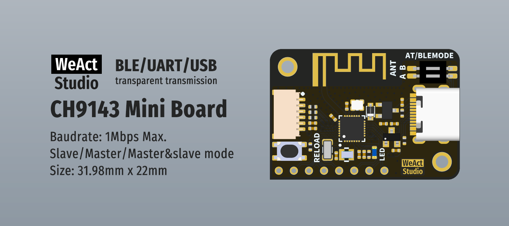

* [English version](./README.md)
# WeActStudio.CH9143_BLE2USB2UART

CH9143 是一款 BLE/UART/USB 三通芯片，实现蓝牙、USB 接口和串口接口之间数据互传。蓝牙支持主机模式、从机模式和主从一体模式，从机模式和主从一体下可对蓝牙通讯以及参数进行配置，支持 BLE4.2。串口支持 AT 指令配置，支持 MODEM 联络信号，最高波特率 1Mbps。同时可实现计算机USB接口、串口和蓝牙之间联机调试或数据监控。  
WCH 官方网站 www.wch.cn(zh-CN) / www.wch-ic.com(en)  
## 功能说明
`一块板子`，可作为USB转串口模块和蓝牙串口模块，对于蓝牙串口模块，WCH提供虚拟串口软件 `BleComWin`，只要电脑支持连接BLE，无需连接USB就可以虚拟出一个COM口。此外还有微信小程序、安卓、IOS、Linux、Windows直连BLE串口的软件，名字为 `BleUart`，提供BLE串口设备的自动搜索连接、打开关闭、串口参数设置、MODEM操作、串口读写等功能。最高波特率为1Mbps。  
`两块板子`，实现无线串口功能，最高波特率为1Mbps。
>> `BleComWin`和`BleUart`，见`Softs`文件夹
### 从机模式 
从机模式下芯片会发送固定广播数据，默认广播名称 `CH9143BLE2U`，广播间隔 100ms。从机支持四种基本蓝牙服务，其中透传服务 UUID 为 0xFFF0。
### 主从一体模式 
主从一体模式为蓝牙主机与从机同时工作，当其中某一角色与其它蓝牙建立连接时，则会停止另一角色。需要注意的是，CH9143 芯片作为蓝牙主机角色，仅能与WCH其他蓝牙芯片建立连接。  
### 智能配对功能
当 CH9143 处于主从一体模式时，无需通过 AT 命令输入 MAC 地址即可与指定 CH914x 芯片建立配对，配对成功后二者建立绑定关系，再次连接时无需重新配对。其配对流程如下：  
1. CH9143 处于主从一体模式，CH9143 处于从机模式或者主从一体模式。
2. 欲建立配对双方在 3s 内完成上电。
3. 指示灯闪烁 3 下后常亮，配对成功。  

若需要重新建立配对需要重新经过配对流程，区别在于步骤 3 指示灯会快速闪烁，此时将任意端重新上电则可重新建立配对。

## 接口说明
### 6 Pin SH1.0接口
|PIN|说明|
|:--:|:--|
|GND|信号/电源地|
|RXD|串口接收（输入，电平3.3V）|
|TXD|3.3V串口发送（输出，电平3.3V）|
|TNOW|串口发送数据状态引脚，高电平有效|
|3V3|3.3V电源输出|
|5V|5V电源输出|  

### AT/BLEMODE 拨码
|序号|说明|
|:--:|:--|
|A|ON，AT模式使能|
|B|ON，从机模式使能|

### RELOAD 按键
恢复出厂设置按键，上电前RELOAD按键按住，3 秒后松开，即可恢复出厂设置，此过程指示灯不会点亮。 
* 两个板子需要配对时，建议将其中一块板子通过`AT/BLEMODE 拨码`固定为从机模式，当需要解除配对，只需恢复主机即可。 
* 当两块板子均处于主从一体模式，需要解除配对时，无法分辨板子是哪个板子是主机，哪个板子是从机，故两块板子都要恢复出厂设置。实际如果知道谁是主机，只需恢复主机即可。

### 蓝色指示灯
|序号|状态|说明|
|:--:|:--|:--|
|1|上电后单次快闪 3 下|当前处于从机模式|
|2|上电后双次快闪 3 下|当前处于主从一体模式|
|3|500ms 间隔慢闪|当前处于广播状态|
|4|常亮|当前处于连接状态|
|5|连接状态快闪|当前正在数据传输|
|6|配对过程中快闪|已与其他设备建立配对，需重新上电完成配对|

## 目录说明
|目录名称|内容|
| :--:|:--:|
|Doc| 数据手册/参考手册|
|Hardware| 硬件资料|
|Drivers|驱动|
|Softs|SDK&上位机|

```
/*---------------------------------------
- WeAct Studio Official Link
- taobao: weactstudio.taobao.com
- aliexpress: weactstudio.aliexpress.com
- github: github.com/WeActStudio
- gitee: gitee.com/WeAct-TC
- blog: www.weact-tc.cn
---------------------------------------*/
```